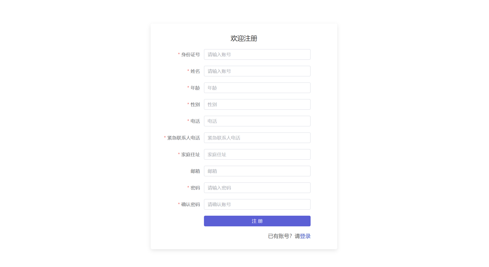

# Vitalis-frontend

## 一、

### （一）登录页


* 向后端发送post请求：```request.post("/login", form)```

form对象中属性:

```javascript
   const form = reactive({
    id: "",
    password: "",
    role: "",   // 管理员 ADMIN, 医生 DOCTOR, 患者 USER
});
```

**定义后端响应对象**：res

```json
{
    "code": "",
    // 表示请求的处理结果。
    // "200"：表示操作成功。
    // "401"：未授权，例如用户登录过期。
    // "400"：参数错误，例如必填字段缺失。
    // "500"：服务器错误。
    "msg":"",
    "data":{
        "id" : "",
        "password" : "",
        "role" : ""
    }
    // 后端返回信息（json串）
}
```

### （二）注册页



* 向后端发送post请求
  ```request.post("/register", form)```

form对象中的属性：

```javascript
const form = reactive({
    id: "",
    password: "",
    confirmPass: "",
    role: "USER",   // 默认只能注册病人（USER）
});
```

**定义后端响应对象**：res

```json
{
    "code": "",
    "msg":"",
    "data":{
        "id" : "",
        "password" : "",
        "role" : ""
    }
}
```

## 二

### （一）个人主页
#### 1.个人信息

##### (1)获取个人信息
* 向后端发送`get`请求：User用户的id
```javascript
this.$request.get(`/user/selectById/${user.id}`)
```

**定义后端响应对象**：res

```json
{
    "code": "",
    "msg":"",
    "data":{
        "avatar" : "", //  用户头像
        "id" : "",
        "name" : "",
        "age" : ,
        "sex" : "",
        "phone" : "",
        "emergencyPhone" : "",
        "email" : "",
        "address" : ""
    }
}
```
##### 2.更新个人信息
* 发送put请求：`this.$request.put('/user/update', user)`
```javascript
user = {
  avatar : "", //  用户头像
  id : "",
  name : "",
  age : ,
  sex : "",
  phone : "",
  emergencyPhone : "",
  email : "",
  address : ""
}
```
* 返回请求处理结果code，以及提示信息msg即可  
  


#### 2.账号管理


#### 3.退出登录

### （一）公告栏

向`/notice/selectAll`发送请求返回公告

**定义后端返回对象**：res（data属性是一个对象组成的数组）

```javascript
{
...
    data: [
        {
            id: int,
            title: "",
            content: "",
            time: "",
            user: ""
        },
        ...
    ]
}
```

### （二）预约挂号

### （三）我的挂号

### （四）我的就诊


