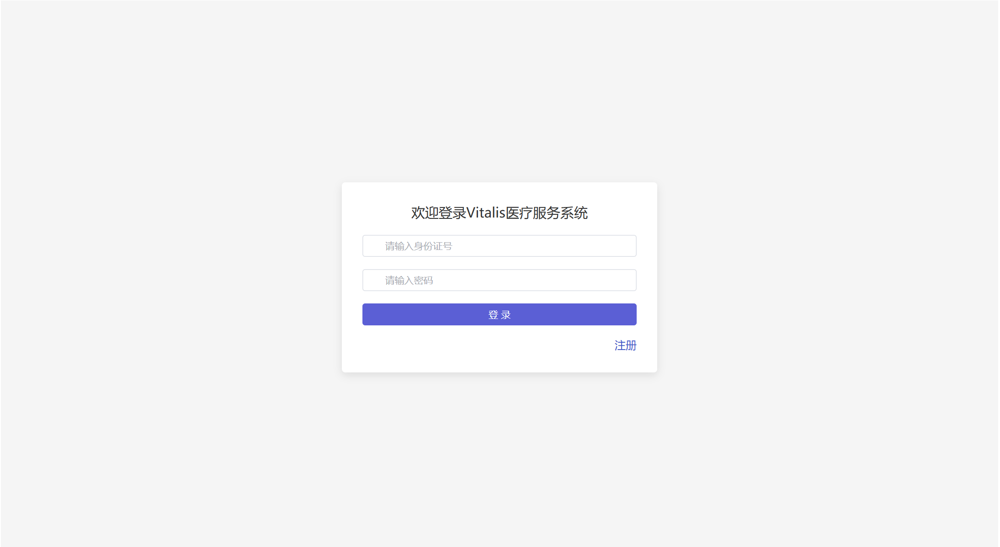

# Vitalis-frontend

## 一、

### （一）登录页



* 向后端发送post请求：```request.post("/login", form)```

form对象中属性:

```javascript
   const form = reactive({
    username: "",
    password: "",
    role: "",   // 管理员 ADMIN, 医生 DOCTOR, 患者 USER
});
```

**定义后端响应对象**：res

```javascript
{
    "code": "",
        // 表示请求的处理结果。
        // "200"：表示操作成功。
        // "401"：未授权，例如用户登录过期。
        // "400"：参数错误，例如必填字段缺失。
        // "500"：服务器错误。
        "msg":"",
        "data":{...
        }
    // 后端返回信息（json串）
}
```

> 前端默认加入管理员：'admin' '123456' 'admin' 'ADMIN'
> 和患者：'zhangsan' '123456' 'zhangsan' 'USER'（建立数据库后删除）

### （二）注册页


* 向后端发送post请求
  ```request.post("/register", form)```

form对象中的属性：

```javascript
const form = reactive({
    username: "",
    password: "",
    confirmPass: "",
    role: "USER",   // 默认只能注册病人（USER）
});
```

## 二

### （一）公告栏

向`/notice/selectAll`发送请求返回公告

**定义后端返回对象**：res（data属性是一个对象组成的数组）

```javascript
{
...
    data: [
        {
            id: int,
            title: "",
            content: "",
            time: "",
            user: ""
        },
        ...
    ]
}
```

### （二）预约挂号

### （三）我的挂号

### （四）我的就诊


