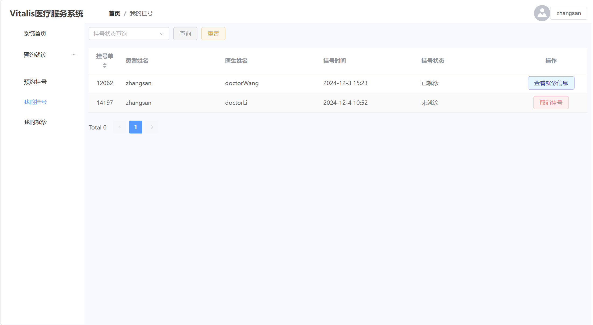

# Vitalis-frontend

## 一、

### （一）登录页


* 向后端发送post请求：```request.post("/login", form)```

form对象中属性:

```javascript
   const form = reactive({
    id: "",
    password: ""
});
```

**定义后端响应对象**：res

```json
{
    "code": "",
    // 表示请求的处理结果。
    // "200"：表示操作成功。
    // "401"：未授权，例如用户登录过期。
    // "400"：参数错误，例如必填字段缺失。
    // "500"：服务器错误。
    "msg":"",
    "data":{
        "id" : "",
        "password" : "",
        "role" : "" // 管理员 ADMIN, 医生 DOCTOR, 患者 USER
    }
    // 后端返回信息（json串）
}
```

### （二）注册页


* 向后端发送post请求
  ```request.post("/register", form)```

form对象中的属性：

```javascript
const form = reactive({
  id: "",
  password: "",
  confirmPass: "",
  name: "",
  age: "",
  sex: "",
  phone: "",
  emergencyPhone: "",
  email: "",
  address: "",
  role: "USER",
});
```

**定义后端响应对象**：res

```json
{
    "code": "",
    "msg":"",
    "data":{
      "id": "",
      "password": "",
      "confirmPass": "",
      "name": "",
      "age": "",
      "sex": "",
      "phone": "",
      "emergencyPhone": "",
      "email": "",
      "address": "",
      "role": "USER"
    }
}
```

## 二、用户系统（病人）

### （一）个人主页
#### 1.个人信息

##### (1)获取个人信息
* 向后端发送`post`请求：`.post("/user/selectById", user)`


**定义后端响应对象**：res

```json
{
    "code": "",
    "msg":"",
    "data":{
        "avatar" : "", //  用户头像
        "id" : "",
        "name" : "",
        "age" : ,
        "sex" : "",
        "phone" : "",
        "emergencyPhone" : "",
        "email" : "",
        "address" : ""
    }
}
```
##### 2.更新个人信息
* 发送post请求：`post('/user/update', user)`
```javascript
user = {
  avatar : "", //  用户头像
  id : "",
  name : "",
  age : ,
  sex : "",
  phone : "",
  emergencyPhone : "",
  email : "",
  address : ""
}
```
* 返回请求处理结果code，以及提示信息msg即可  
  


#### 2.账号管理

* 修改密码：`post("/updatePassword", user)`
```javascript
user = {
    password : "", // 原始密码
    newPassword : "", // 新密码
    ...
}
```

#### 3.退出登录

### （二）首页（公告栏）

向`/notice/selectAll`发送请求返回公告
```javascript
request.post("/notice/selectAll")
```
**定义后端返回对象**：res（data属性是一个对象组成的数组）

```javascript
{
...
    data: [
        {
          id: 1,
          title: "title",
          content:"content",
          time:"2024-5-6",
          user:"zhangsan"
        },
        ...
    ]
}
```

### （三）预约挂号

#### 1.获取科室数据
```javascript
request.post("/department/selectAll")
```

* **定义后端返回对象**：res
```javascript
res = {
    id : 1, // 科室id
    name : ""   // 科室名称
}
```
#### 2.分页查询医生数据
```javascript
request.post("/doctor/selectPage2", {
        params: {
          pageNum: pageNum,
          pageSize: pageSize,
          departmentId: departmentId,
          date: formatDate
        }
      })
```
* **定义后端返回对象**：res
```javascript
res = {
    total: n, // 返回数据的数量
    tableData: [
      {
        photo: "",    // 照片
        id: "",     // 医生id
        name: "",
        departmentName: "",   // 科室
        title: "",  // 职称
        specialty: "",  // 主治疾病
        description: "",    // 医生简介
        phone: "", // 联系电话
        consultDays: "", // 坐诊日
        date: ""    // 查询日期
      }
    ]
}
```

#### 3.挂号

* `request.post("/reserve/add", data)`
```javascript
data = {
    userId: user.id,
    doctorId: doctorId
  }
```

### （四）我的挂号

#### 1.查询数据
```javascript
request.post("/reserve/selectPage", {
          params: {
            pageNum,
            pageSize: pageSize.value,
            status: status.value,
            id: user.value.id       // 患者id
          }
        })
```

* **定义后端返回对象**：res
```javascript
res = {
    total: n, // 返回数据的数量
    tableData: [
      {
        id: 12062,  // 挂号单id
        name: 'zhangsan',
        doctor: 'doctorWang',
        date: "2024-12-3 15:23",    // 挂号时间
        status: "已就诊"
      }
    ]
}
```

#### 2.取消预约
```javascript
request.post("/reserve/delete", id) // 直接传递预约单id
```


### （五）我的就诊


#### 1.查询数据
```javascript
request.post("/record/selectPage", {
          params: {
            pageNum: pageNum.value,
            pageSize: pageSize.value,
            id: user.value.id   // 患者id
          }
        })
```
* **定义后端返回对象**：res
```javascript
res = {
    total: n, // 返回数据的数量
    tableData: [
      {
        id: "15306",    // 挂号单id
        name: "zhangsan",
        doctor: "doctorWang",
        date: "2024-12-4 16:31",        // 就诊时间
        medicalRecord: "medicalRecord", // 医嘱
        prescription: "prescription"    // 处方
      } 
    ]
}
```


